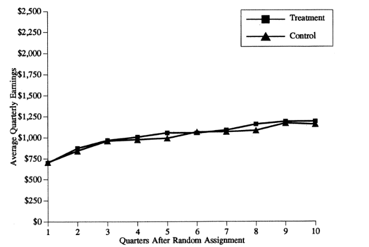

<!-- This documents includes the header and setup information so that the chapter can converted to a single html document.  The references will appear in each chapter, rather than collected in a separate chapter -->

```{r setup, echo=FALSE, comment=FALSE, message=FALSE}
library(haven)
library(tidyverse)
library(car)
library(questionr)
library(knitr)
library(matrixStats)

windowsFonts(A = windowsFont("Garamond"))
theme_set(theme_classic(base_size = 12,  base_family="A"))
```
<!-- Everything below this line is identical to the bookdown files on github -->

# An introduction to measures of association: correlation

Many research questions in many different disciplines focus on the answer to one simple question: If you compare members of two groups, how does the mean of some variable of interest differ?  In medicine, how does the treatment group differ from the control group - what is the *average treatment effect*?  In public policy, what happens to people who participate in a government program compared to people who do not?  In social science research, what happens when you are exposed to more news or a diverse social environment?

There are two primary approaches to tackle this kind of empirical question:  observe or experiment. Experiments are vastly superior to observation and we rely on particularly rigorous experimental evidence in, for instance, the Food and Drug Administration new drug approval process. Medical research typically relies on double blind randomized trials – an experiment where people are randomly given either a treatment or a placebo and neither the researcher nor the patient knows who is given which drug or treatment.  The only thing that is different between the control group and the treatment group is exposure to the treatment – the groups do not vary in any other way – no demographic differences, no differences in geographic location, and no differences in interactions with the researcher.  This strategy isolates the effect of the treatment or the drug from any other variable.

The second best alternative – and the strategy we rely on this course – is observation.  We observe people who are grouped by some characteristics (not assigned randomly) and try use the help of statistics to isolate the effect of that characteristic.  In your first assignment you may have looked the party identification of young people compared to older people. But, in the contemporary United States, the demographics and geography of a group of old people is likely to be quite different than a group of young people.  Older Americans are more likely to be white and have, on average, a much lower level of education.  It is also likely the case that the older group will be more likely to live in the Mountain and Midwest region.  So an observational strategy does not permit us to precisely isolate the effects of age alone.  

After reviewing a few the key features of experimental research designs, we will turn to the ways that we use statistics to implement an observational strategy.

@# Experimental research in social science and public policy

The social sciences – economics, sociology, political science – have historically relied more on observation and less on experiments. But there are at least two types of experimental designs that are fairly common in social science. Public policy can be evaluated by randomly assigning people to receive or not receive some service or program.  And, survey research can randomly give one set of questions to one group and another set of questions to another group. 

One interesting set of work in the survey tradition asks respondents to evaluate a candidate’s suitability for office after reading a biographical sketch and viewing a picture. One group – selected at random – is shown a picture of a white candidate.  The second group is shown a picture of a minority candidate.  The *manipulation*  - what is changed as the survey is repeated - is simply the picture.  For example, @terkildsen1997 surveyed white members of jury pools in Kentucky in 1991/2 and found that white candidates are viewed more favorably than minority candidates: this is obviously troubling - this is a jury!

The costs and complexity of this type of experiment are important to understand – two different surveys need to be administered to two groups taken completely at random from some potential pool.  The Kentucky survey required cooperation and consent from the local authorities to gain access to the jury pool and all of the interviews were conducted face-to-face.  You cannot rely on already completed surveys to go back and manipulate survey conditions or wording, so historical research of this type is not possible.  Experimental research design also requires careful attention to survey wording and conditions and many political science researchers, for instance, don’t have extensive training in this design (compared to psychologists who have decades of experience with these types of experiments).

Social science experiments also raise ethical questions: We cringe at the idea that a social scientist might manipulate the vote choice or other attitudes in the form an experiment. This problem emerged in a recent controversial experiment by two political scientists studying judicial elections in Montana [@johnson2015].

Public policy experiments raise similar challenges.  In order to test the effect of a program, some people need to get access and others must be denied access. This is similar to the ethical dilemma faced by medical researchers – the benefits to gaining information about the efficacy of a drug must outweigh the costs of delaying treatment of people randomly assigned to a control group.  Can we undo the impact of denying access to a program that works?  Administrative costs are also a factor. In order to test a new program, agencies might need to simultaneously administer two programs – the original and the new program – to see what happens over the course of a year or more.  This is expensive.

But the benefits of experimental approaches can be large: what if we had access to good data about exactly which government programs worked and with what effect.  We could make better decisions about the allocation of resources.  This insight is behind a recent collection of essays published as *Moneyball for Government* [@nussle].  Any program that has high levels of demand and low levels of available services is a candidate for an experiment.  One randomly selected group of applicants – to a charter school or for a particular drug treatment program or repeat offender intervention – can receive the treatment. The remainder of the applicants can be wait-listed for one year. After one year, is the treatment group better off?  In medicine, this experimental design is being advocated not just as a way to evaluate new drugs, but for all sorts of innovations in medical practice (see @sangerkatz2014 for an overview of this controversy).

### An example: Job Training and Partnership Act (JTPA) programs 

An early and compelling example of this type of research involved an evaluation of Job Training and Partnership Act (JTPA) programs in the late 1980s.  The JTPA programs offered classroom training, on-the-job training, or job search assistance to people who are out of work.  In September, 1987: two-thirds of the eligible population who applied to the program were directed to services, one-third were deferred for 18 months.  Do training and services offered to the unemployed increase earnings?  The results are summarized in the two figures below.

#### Figure 3.1  Estimated effects of JTPA programs on earnings

Women 21 and over
```{r jhr1, echo=FALSE, out.width = '80%'}
knitr::include_graphics("images/bloom19971a.png")
```

Women 18-20
```{r jhr2c, echo=FALSE, out.width = '80%'}

```

Reproduced from @bloom1997.  “The Benefits and Costs of JTPA Title II-A Programs….”

The results are remarkable.  The benefits of the program for adult women were large: they had persistent positive differences in earnings.  Women who got the service earned more money (and paid more taxes!) in the long run.  The program worked.  But the benefits were not observed for younger women – these services did not work.  A sensible response to this evaluation would be to design different services for younger women and enroll as many adult women as possible in order to produce long-term earnings gains for as many unemployed older women as possible.  

## Observational approaches: What are our options?

How do we compare two groups if we can’t do an experiment?  For the first assignment you compared the party identification of two groups.  Your strategy was to compare a few key descriptive statistics and to report a few percentages that summarized group differences. You used a frequency distribution to produce the percentages – this is known as a “one-way” table. We can also use figures and two-way tables to do summarize the same types of information.

```{r anes, echo=FALSE}
# Read the data
anes2020 <- read_dta("data/anes_timeseries_2020_stata_20210719.dta")

# Variables needed for this chapter:
# Weight
# Income in 3 categories
# Party identification
# Donald Trump feeling thermometer
# Education
# Income - not in categories
# Ideology

anes2020$weight<-anes2020$V200010b 
# This is the "full sample post-election weight"

# Party id
anes2020$partyid<-car::recode(anes2020$V201231x, "-9:-7=NA") 
anes2020$partyid <- factor(anes2020$partyid,
levels = c(1,2,3,4,5,6,7), ordered=TRUE,
labels = c("Strong Democrat", "Not very strong Democrat", "Leaning Democrat", "Independent", "Leaning Republican", "Not very strong Republican", "Strong Republican"))

# Income
anes2020$income<-car::recode(anes2020$V201617x, "-9:0=NA")
anes2020$income3<-car::recode(anes2020$V201617x, "-9:0=NA; 1:4=1; 5:19=2; 20:22=3")
anes2020$income3 <- factor(anes2020$income3,
levels = c(1,2,3),
labels = c("Under $25,000", "$25,000 to $150,000", "Over $150,000"))

# Education
anes2020$education<-car::recode(anes2020$V201510, "-9:0=NA; 95=NA")
anes2020$college  <-car::recode(anes2020$V201510, "-9:0=NA; 95=0; 1:5=0; 6:8=1")


# Feeling thermometer - Donald Trump
anes2020$ft_Trump<-car::recode(anes2020$V202144, "-9:-4=NA")

# Ideology self-placement
anes2020$ideology<-car::recode(anes2020$V201200, "-9:-7=NA") 
anes2020$ideology <- factor(anes2020$ideology,
levels = c(1,2,3,4,5,6,7), ordered=TRUE,
labels = c("Extremely liberal", "Liberal", "Slightly liberal", "Middle of the road", "Slightly conservative", "Conservative", "Extremely conservative"))


# Interest in politics
anes2020$interest<-car::recode(anes2020$V202407, "-9:-5=NA; 1=4; 2=3; 3=2; 4=1")
anes2020$interest <- factor(anes2020$interest,
levels = c(1,2,3,4), ordered=TRUE,
labels = c("Not at all", "Not very closely" ,"Fairly closely", "Very closely"))

# Create function for weighted cross-tab <-see below
# Subset to exclude missing values

```


### Tables

If you want to compare the values of some variable of interest (party identification) over the levels of some other variable (education, income, gender), we can produce a table with the same types of percentages we observed in the frequency table.  This is known as *cross tabulation* and the two-variable or two-way table that we produce is known as a *cross-tab*. For now, we are going to ignore the problem that the grouping by one predictor variable does not create random groups – we will turn to this problem later.

#### Example: party id and income

How would you expect the distribution of party id to change across income groups?   Building on the income and vote example from Chapter 1, what should we observe for low income respondents?  What should we observe for high income respondents?

One way to answer this question empirically is to create a cross-tab of income and party id using the ANES.  For this example, I created a measure of household income divides respondents into three categories - low income, middle income, an high income  The table is reproduced as Table 3.1, below

#### Table 3.1 Party identification and income, 2020 ANES
```{r table31 r, echo=FALSE}
table31<-100*prop.table(wtd.table(anes2020$partyid, anes2020$income3, anes2020$weight), margin=2)
kable(table31, digits=1)
```

Is this consistent with your expectations?  It is clear that you are roughly 1.5 times likely to be strong Republican if you are in an upper income household (19% compared to 14% for the lower income).  But there are about the same proportion of strong Democrats in upper and lower income households (23% in the upper income households and 27% in lower income households). In Chapter 1 we observed that the highest level of Trump support was from middle income households.  Data on party identification reinforce this conclusion.  The people who are most likely to identify as strong Republican are middle income households. Also notice that the number of independents plunges as you move up the income scale - people in higher income households are more likely to report an identification with one of the major parties.

### Figures

In many cases it is more useful to produce a figure than a table.

What if the table implied your choice of variables is very large? In the example above: 7 categories for the rows and 3 categories for the columns implies a total of 21 cells or percentages. That is a lot of numbers to process to make a simple point.  In the example below I use a column variable with 100 categories and a row variable with 7 categories (party identification).  A two-way table with these variables would have 700 cells!

#### Example.  Feeling thermometers and party identification

Before revisiting the income and party identification data, consider an example that introduces the ANES feeling thermometers. These survey item asks you how you feel about particular groups, things or people – gays and lesbians, the military, Southerners, Anthony Fauci, Donald Trump.  The feeling thermometer responses can range from zero – I feel very cool or negative towards this person, symbol or group – to 100 – I am very warm or positive towards this person, feeling or group. These thermometers show up prominently in some of the readings for the course and in the papers you will write.

How are attitudes about Donald Trump related to party id?  How different are strong Democrats and strong Republicans on the 100 point feeling thermometer for Donald Trump?

There are three visualization strategies we could use to summarize the link between the variables we are interested in: a scatterplot, a bar chart of group means, or a line chart for group means.  An example of each is below.  In each figure, the vertical axis represents what we are trying to explain or understand – what is known as the dependent variable (Y).  The horizontal axis represents the predictor – what is known as the independent variable (X).  We are trying to show if there is a link between Y and X. 

#### Figure 3.2 Scatterplot.  Donald Trump feeling thermometer and party id
```{r figure2, warning=FALSE, message=FALSE, echo=FALSE}
figure2<-anes2020 %>% filter(anes2020$partyid!="NA")
ggplot (figure2, aes(x=partyid, y=ft_Trump))+geom_point()+ylab("Feeling thermometer") + xlab("Party identification") + theme(axis.text.x=element_text(size=rel(0.70)))
```

The first figure – the scatterplot – is obviously not very useful. Since there are 5,000 respondents and 700 cells, at least one person occupies most cells on the table. You just end with a grid. This will be the case with any survey with a finite or small number of possible responses and many participants.

The second and third figures, below, make things very clear.  There is a steep decrease in positive feelings as you move from strong Democrat to strong Republican.  The third figure appears more dramatic since the Y-axis excludes 0 and 100, so the effect is steeper.  Notice that, as you might have expected, the Independent-leaners are actually strong partisans in their attitudes.

#### Figure 3.3 Bar chart of group means. Donald Trump feeling thermometer and party id.
```{r figure3, warning=FALSE, echo=FALSE, message=FALSE}
ggplot (figure2, aes(x=partyid, y=ft_Trump))+geom_bar(stat = "summary", fun.y = "mean")+ylab("Feeling thermometer") + xlab("Party identification") + theme(axis.text.x=element_text(size=rel(0.70)))
```

#### Figure 3.4. Line chart.  Donald Trump feeling thermometer and party id
```{r figure4, warning=FALSE, message=FALSE, echo=FALSE}
figure4<-figure2 %>% group_by(partyid) %>% summarise(mean=mean(ft_Trump, na.rm=TRUE))

ggplot (figure4, aes(x=partyid, y=mean, group=1))+ylab("Feeling thermometer") + geom_line() +xlab("Party identification") + theme(axis.text.x=element_text(size=rel(0.70)))
```

### Income and party identification revisited

We used a table to describe the link between party identification and income in three broad categories.  It might make sense to stick with the original, more finely grained scale of income - which ranges from 1 to 28.  Figure 3.5 – a line chart of average party identification for each of the 28 income categories in the 2020 ANES - suggests that there is a very weak relationship with between household income and party id - higher income households might be slightly more Republican on the party id scale.

#### Figure 3.5. Income and party identification

```{r figure5, warning=FALSE, message=FALSE, echo=FALSE}
figure5<-anes2020 %>% group_by(income) %>% summarise(mean=mean(as.numeric(partyid), na.rm=TRUE))
figure5<-figure5 %>% drop_na()
ggplot (figure5, aes(x=income, y=mean, group=1))+ylab("Party identification") + geom_line() +xlab("Household income") + theme(axis.text.x=element_text(size=rel(0.70)))
```

The relationship between income and party id is “noisy” – the line does not move up in equal increments across all income categories  And the drop in the average thermometer for the highest income households suggest that any idea that rich households overwhelmingly identify as Republican is clearly wrong.

## So why use statistics if we can summarize with figures?

Why do use statistics?  The simple answer: since we are using a small sample. 

How do know if the relationship observed in the small sample – increasing support for Donald Trump as you move to strong Republican – is also observed in the broader population?

We use statistics – specifically a group of test statistics known as measures of association to make an *inference* about the relationship in the population.  One of these measures of association, correlation, is briefly introduced below and two others are developed in Chapters 4 and 5.

Inference is learning about something we cannot observe from something we can observe.  We can observe small samples.  We often cannot observe and measure populations – this is too expensive and not practical.   Inference is learning about populations from samples.

The key to this form of inference is that samples must be random. Any individual in the population must have an equal, identical chance of appearing in the sample.  Prior to the widespread use of cell phones, random digit dialing of landlines could yield a random national sample.   Today it is harder to reach voters via cell phones.  The ANES overcomes this problem by relying mainly on face-to-face interviews.  There is still a problem facing social scientists known as *nonresponse bias*.  Individuals who are willing to participate in a survey may be different than individuals not willing to participate – this could make the survey far from a truly random slice of the population.  This could be a problem with ANES data – are people who are willing to participate in a relatively long face-to-face interview about politics likely to be more interested, more likely to vote, and have more information about politics than someone who will not participate?  If yes, then our sample will not be random and nonresponse bias could influence some of our findings.

## What are measures of association?

If we do have a random sample from a broader population, we can use measures of association to describe relationships between variables.  In the lexicon of data science, the variable we are primarily interested in known as the dependent variable ($Y$) and the predictor variable is known as the independent variable ($X$). We assume (expect) that $X$ influences $Y$ or $Y$ is a function of $X$.

We use measures of association to answer three questions:  What is the direction of the relationship between $X$ and $Y$.  Does an increase in $X$ increase (+) Y or decrease (-) $Y$?  What is the size of the effect?  Does $X$ have a big impact on $Y$ or small?  Could the observed effect be due to chance?  Or is the effect statistically significant?  We will focus on size and direction as we learn about correlation and turn to the concept of statistical significance in Chapter 5.

Recall the discussion of types of variables in earlier chapters.  We distinguish between categorical variables (respondents are grouped into categories that cannot be ranked – region, religion, marital status), ordinal variables (respondents are grouped into categories that can be ranked (party id, ideology) or interval variables (Respondents are grouped into categories that can be ranked on a scale with equal intervals between units – like age or years of education).

For this course, we look at three different measures of association:  chi-square, correlation, and the t-test.   The choice of which measure of association to use is determined by the types of variables you are using.

* If $X$ and $Y$ are both either interval or ordinal, then it is appropriate to use correlation

* If $X$ and $Y$ are both categorical, then it is only appropriate to use chi-square.

* If $Y$ is interval or ordinal and $X$ is a categorical variable with only two categories, then we use the t-test.

The logic behind or question that motivates each of these measures is the same – is the mean value of a variable ($Y$) different across different values of the $X$ variable.  We first come with a theory about what we expect and we test that theory with the data we collect.  We use the measures of association to figure out what the data permit us to conclude. 
We might produce a figure to communicate what we have learned to a client or colleague.

## Correlation

In many research situations, the variables of interest are both some type of scale - either an interval or an ordinal variable.  This would include concrete measures like household income, year of education, or age, and concepts that we order in a meaningful way – like ideology (from extreme liberal to extreme conservative) or party identification (from strong Democrat to strong Republican) or a feeling thermometer (from 0 – don’t like it – to 100- really like it).  If you are interested in determining the relationship between two variables that are scales, then you should calculate and use the correlation coefficient.

### What is correlation?

Correlation is a measure of association appropriate for interval level variables (and can be applied to ordinal variables that are “approximately interval” e.g. party id or ideology).  The test statistic ranges from -1 to +1 and gives you a one-number summary of the direction and size of the relationship between $X$ and $Y$.  

If two variables have a correlation of +1 or -1, then they are perfectly correlated.  If correlation is greater than 0, then the variables are described as positively related or directly related.  If correlation is less than 0, then the variables are described as negatively related or inversely related.  As the correlation moves away from zero (closer to +1 or -1), the stronger the link between $X$ and $Y$. A correlation of zero is a null relationship.  Negative does not mean null. Null is zero.  To give you a sense how numbers translate into data, the figures below show hypothetical samples wth different levels of correlation.


####  Figure 3.6 Positive, negative and null effects
```{r example, echo=FALSE, comment="", warning=FALSE }
complement <- function(y, rho, x) {
  if (missing(x)) x <- rnorm(length(y)) # Optional: supply a default if `x` is not given
  y.perp <- residuals(lm(x ~ y))
  rho * sd(y.perp) * y + y.perp * sd(y) * sqrt(1 - rho^2)
}
set.seed(9234)
y <- rnorm(50, sd=10)
x <- 1:50 # Optional
rho <- seq(0, 1, length.out=6) * rep(c(-1,1), 3)
X <- data.frame(z=as.vector(sapply(rho, function(rho) complement(y, rho, x))),
                rho=ordered(rep(signif(rho, 2), each=length(y))),
                y=rep(y, length(rho)))
    
library(ggplot2)
ggplot(X, aes(z,y, group=rho)) + 
  geom_smooth(method="lm", color="Black") + 
  #geom_rug(sides="b") +
  xlab("X") + ylab("Y") +
  geom_point(aes(fill=rho), alpha=1/2, shape=21) +
  facet_wrap(~ rho, scales="free") +
  theme(legend.position = "none")
```

You can always describe your expectations using these numbers. For example, you would expect to observe that as the education level of a respondent increased, income would also increase. Income should be positively correlated with education. Maybe something in between what we observe above for 0.2 and 0.6?   

### Computation

Computation of the correlation coefficient requires that we compute the covariance of two variables and the standard deviation of each variable.

Recall that standard deviation $\sigma$is simply the square root of the sample variance.  

$$ \sigma_x = \sqrt{\frac{( \sum_{i=1}^n (X_i - \mu)^2}{n-1}}$$

We compare every individual value of $X$ to the group mean.  If many people are higher or lower than the mean, we see that the variance and standard deviation are high.  If many people are close to or equal to the group mean, we see that the variance and the standard deviation are low.

The building block for correlation is the covariance and it follows the same logic as the variance.  We compare very individual of $X$ to the mean of $X$ and multiply that by same individual’s value of $Y$ minus the mean of $Y$.   If people who have high values of, for example, income also have high values of party id then that implies a positive covariance.  If people who are low income are low on the party id scale that also implies a positive covariance.  

In symbols, the covariance is:

$$
cov(x,y)= \frac{\sum_{i=1}^n (X_i - \mu)^2 (Y_i - \mu)^2}{n-1}
$$

Once we know the covariance between the two variables and the standard deviation for each variable, we can calculate the correlation. The sample correlation coefficient ($\rho$) is, in words, the covariance between $X$ and $Y$ divided by the standard deviation of $X$ and the standard deviation of $Y$.  In symbols:

$$
\rho=\frac{cov(X,Y)} {\sigma_x\sigma_y}
$$

This number (the correlation) can never be large than 1.0 and never be smaller than -1.0.  The farther the number is from zero, the larger the effect of $X$ on $Y$.

### Limits of the correlation coefficient

Three important cautions about correlation. 

#### Correlation is most useful as a relative measure

First, correlation is best used as a description of the direction and relative size of the relationship (i.e. a correlation of .8 is a stronger correlation than a correlation of .5).  It is less useful as an absolute measure.  A correlation of 0.5 without knowing the type of dataset, variables, or other correlations in the sample would not be very helpful to understand what is important or what is a weak predictor.

#### Correlation assumes a linear relationship

Second, statements about correlation also assume that the relationship between two variables is linear (or approximately linear). Nonlinear relationships may not be reflected in correlation. 

For instance, we could not test the link between party id and attention to politics with a correlation coefficient. This would not work since strong Republicans and strong Democrats are both likely to pay attention to campaigns, while Independents are not likely to pay attention – the relationship between party id and attention is U-shaped or nonlinear. 

#### Figure 5. Example of a U-shaped relationship. Partisanship and interest in politics
```{r figure7, echo=FALSE, comment="", message=FALSE, warning=FALSE}
figure7<-anes2020 %>% group_by(partyid) %>% summarise(mean=mean(as.numeric(interest), na.rm=TRUE))
figure7<-figure7 %>% drop_na()
ggplot (figure7, aes(x=partyid, y=mean, group=1))+ylab("Interest in politics") + geom_smooth(span=9, se=FALSE) + geom_line() +xlab("Party identification") + theme(axis.text.x=element_text(size=rel(0.70)))
```

Notice, again, that leaners are more likely strong partisans - very interested in politics compared to weak partisans.  The interest scale goes from 1 to 4 and 3.0 indicates that someone follows politics "Fairly closely."  The blue span is the best-fitting curve.

#### Correlation doesn't work for arbitrary categories

Finally, never use correlation if variables are not scales. Recall that we have access to a number of variables that are simply categories- race, religion, and region.  We use a number to place people in categories. For the 2020 ANES religion variable, 1=mainline Protestant and 4=Roman Catholic.  The numbers are meaningless in the sense that Catholics are not 4 times more anything than Protestants and we could just as easily used  1=Roman Catholic or 3=Roman Catholic.

Any time the order of the categories is arbitrary (race, marital status, employment status, region, religion), you should not use correlation since it will be misleading and uninformative. You will see an example of this on the final exam and you should be able to report that the correlation is meaningless.  Almost everyone gets this question wrong on the exam!

### Reading a correlation matrix

Most statistical software produces correlations in the form of a matrix.  Table 3.2 reproduces output that summarizes the link between education and income.  We just need to focus one number for now the Pearson correlation at the top right corner.

#### Table 3.2 Correlation between education and income
```{r table2, echo=FALSE, comment=""}
df<- anes2020 %>% select(income, education, weight) %>% drop_na()
test<-cov.wt(df, wt=df$weight, cor=TRUE)
round(test$cor[1:2,1:2], digits=3)

df<- anes2020 %>% select(partyid, ft_Trump, weight) %>% drop_na() %>% mutate(partyid=as.numeric(partyid))
test<-cov.wt(df, wt=df$weight, cor=TRUE)
# No output - this shows up in the Powerpoint
#round(test$cor[1:2,1:2], digits=3)
```
 
The correlation between income and education in this sample is 0.369.  We can learn two things from this output.  First, the link between income and education is positive, more years of education leads to higher average income.  Second, the link is not perfect – there are many poorly educated high income respondents and highly educated lower income respondents. As we expected, the actual correlation was between 0.2 and 0.6.

Note that the most useful way to use correlation is to compare the correlations between two pairs of variables from the same dataset.  Table 3.3 treats ideology as our dependent variable $Y$ and tests the link with two independent variables, education and income.  The ideology scale is order from 1=extremely liberal to 7=extremely conservative – so this variable is ordinal – and higher means more conservative.

#### Table 3.3  Correlation between ideology, party id, education, and income.
```{r table3, echo=FALSE, comment="", warning=FALSE}
df<- anes2020 %>% select(ideology, partyid, income, education, weight) %>% drop_na() %>% mutate(ideology=as.numeric(ideology), partyid=as.numeric(partyid))
test<-cov.wt(df, wt=df$weight, cor=TRUE)
round(test$cor[1:4,1:4], digits=3)
# 
```

This output is in the form of a correlation matrix – so you can see all three correlations – party vs. ideology, education vs. ideology, and income vs. ideology in one table.  In this sample, the correlation between ideology and income is very close to zero (-0.005) – there is no relationship.  The link between education and ideology is a bit stronger and negative (-0.141) – more education means a slightly lower ideology or more liberal.  It would be safe to conclude that poorly educated respondents are the most conservative and highly educated are the most liberal. But party id is clearly the best predictor (0.735 - the fartherst of any of the correlations from zero). We can also see that education and income are more closely  related to each other (0.350) than either are to ideology.  The number in this table is slightly different than immediately above since a few observations were missing - meaning that a few respondents did not answer the ideology question.

## Conclusion

While figures and tables are useful for communicating what we see or learn from data, measures of association give us two ways to leverage information – first we can do a better job comparing the size of two effects with a number than we can with a figure or table.  Second, and the focus of the next chapter, we can be precise about what we can infer about the broader population from our small sample.  Correlation is a particularly simple and useful way to summarize the direction and relative size of the link between any variables that are ordered in meaningful way.
