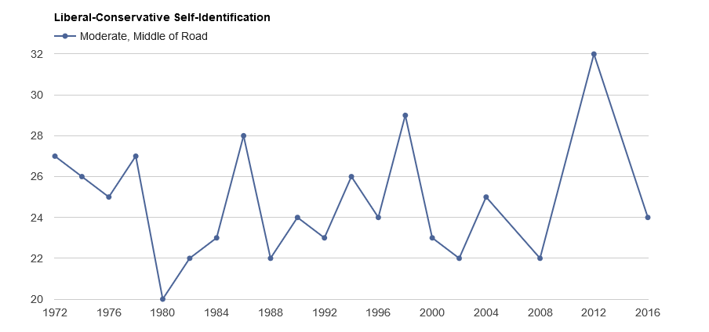
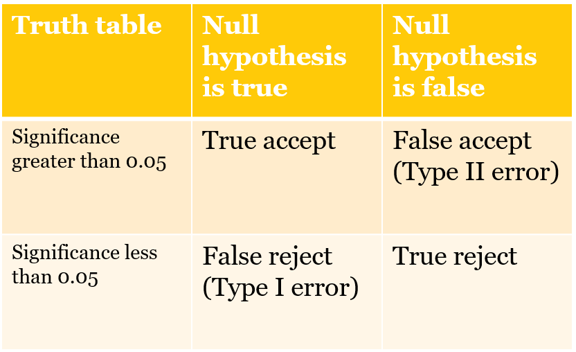

# Measures of association: chi-square

The chi-square test statistic is appropriate when the relationship between two variables can be summarized with a simple table.  You can use the table to determine the direction of the relationship and whether the effect on Y is large or small and you can use a measure of association - the chi-square - to make an inference about the population from the sample data.

In this chapter we will use an example – the link between gender and ideology self-placement - to introduce the chi-square – how the statistic is calculated, what it means, and how you can use the test statistic to evaluate what you find in a sample.   We also cover hypothesis testing and Type I and Type II errors.

## What is the distribution of ideology today?

The ANES includes a survey question that asks respondents to report their ideology - a "self-placement." The distribution of the response in 2020 is summarized below in Table 5.1


```{r anes, echo=FALSE}
# Read the data
anes2020 <- read_dta("anes_timeseries_2020_stata_20210719.dta")

# Variables needed for this chapter:
# Ideology
# Gender

anes2020$weight<-anes2020$V200010b 
# This is the "full sample post-election weight"

# Gender in two categories
anes2020$female<-car::recode(anes2020$V201600, "1=0; 2=1; -9=NA") # 2 is Female, recoded to 1 is female
anes2020$female <- factor(anes2020$female,
levels = c(0,1), ordered=TRUE,
labels = c("Men", "Women"))

# Ideology

# Ideology self-placement
anes2020$ideology<-car::recode(anes2020$V201200, "-9:-7=NA") 
anes2020$ideology <- factor(anes2020$ideology,
levels = c(1,2,3,4,5,6,7), ordered=TRUE,
labels = c("Extremely liberal", "Liberal", "Slightly liberal", "Middle of the road", "Slightly conservative", "Conservative", "Extremely conservative"))

```

### Table 5.1 2020 ANES ideology measure {-}

```{r table51 r, echo=FALSE}
table51<-100*prop.table(wtd.table(x=anes2020$ideology, w=anes2020$weight))
kable(table51, digits=1, col.names=c("Ideology", "Percentage"))
```

We have learned that a larger proportion of Americans are strong partisans, but despite that partisan identity, most voters pick “middle of the road” to describe their ideology.  Figure 5.1 reports the proportion selecting “middle of the road’ in each ANES sample from 1972 thru 2016 [@anesguide]. The middle of the road is obviously the mode but there are two other responses - liberal and conservative - that now make up over 1/3 of the electorate - so today there are more "ideologues" - a fair characterization? - than moderates. 

### Figure 5.1.   Middle of the road is always the mode {-}
```{r figure_1, echo=FALSE, out.width = '100%'}

```


## Should we expect differences between men and women?

Is there a link between gender and ideology?  Are men or women more likely to self-identify as a conservative or liberal or middle of the road? 

Given what you see in Table 5.1, what would you expect to see if we compared men and women? There might be a couple of reasons that could lead you to the idea that women are more liberal.  We know that women are more likely to identity as strong Democrats, so there might be reasons rooted in partisanship to find more female liberals.  Women are more likely to be economically disadvantaged, heading single parent households, receiving less pay for the same work, so that also might lead to more liberal views, particularly attitudes toward social welfare.  Some might also make a case based on psychological differences – if women are more nurturing and caring, then there could be fewer conservative women.  To test the basic expectation – that women are more likely to self-place as liberal – we can produce a simple table and ask for the chi-square test statistic.

The data from the 2020 ANES is summarized below in Table 5.2.  The test statistic is reported at the bottom ot the table.  

### Table 5.2.  Gender and ideology, percentages, 2020 ANES{-}
```{r table52 r, echo=FALSE, comment=""}
table52<-100*prop.table(wtd.table(anes2020$female, anes2020$ideology, anes2020$weight), margin=1)
kable(table52, digits=1)
test1<-chisq.test(wtd.table(anes2020$female, anes2020$ideology, anes2020$weight))
cat("Chi-square =", test1$statistic, ", p =", sprintf("%.3f",round(test1$p.value, 3)), ", df =", test1$parameter)
```

The table suggests that there are some differences in the distribution of ideology.  While the most common response - or mode - for men and women is the same ("Middle of the road") and the second most frequent response is also the same ("Conservative"), there are a higher proportion of women in each of the three liberal categories.  So women are slightly more liberal than men.  You can see that the p-value or significance level associated with this table is 0.000, so we know the result is statistically significant.

The actual test statistic- the chi-square -is computed by comparing the actual number of people in each cell of the table with the expected number of people in each cell.  The expected number is the number we would see if the distribution of the groups was identical, the same as the entire sample. The observed and expected counts for the 2020 table are reproduced below.  We expect to see more women than men in each cell since there are more women in the sample.

### Table 5.3.  Gender and ideology, observed counts, 2020 ANES{-}
```{r table53 r, echo=FALSE, comment=""}
kable(round(test1$observed,0))
```

### Table 5.4.  Gender and ideology, expected counts, 2020 ANES{-}

```{r table54 r, echo=FALSE, comment=""}
kable(round(test1$expected,0))

```

## Chi-square tests

### How do we calculate chi-square?{-}

The chi-square test statistic (55.49, from Table 5.2) is computed by comparing expected and observed numbers in each cell of the table (14 cells in the example above – 7 columns for 2 groups).  For instance, if the distribution of ideology was identical for men and women, we would expect 15.6% of men and 15.6% of women to be liberal (this is based on the distribution reported in Table 5.1).

In Table 5.4, you can see the number of liberal women we should see or expect if the distribution was identical - 479. The number we actually see - in Table 5.3 - is 542.  To compute the chi-square we take the difference between expected and observed, square it, divide by expected and repeat that for all 14 cells in the table and sum those caculations.  For the numbers above $(542-479)^2/479=8.3$. It is obvious that this cell contributes to the large chi-square we observe.  But look at the large differences in the conservatives and slightly conservative columns.  Many more men are slightly conservative and conservative.  All of these differences combined lead to the chi-square of 55.49.  How do we use this number?

### How do we use chi-square?{-}

So what do we learn from chi-square?  Notice that the chi-square is associated with a p-value.  This is known as the significance level or probability value ($p$).  We use this number to determine if we can make an inference about the population from our sample data.

If $p<0.05$, then we can very confident that the result we observe in the sample will also be observed in the population. If $p>0.05$, then we cannot make that inference. If $p<0.05$, then we say that the link between $X$ and $Y$ is statistically significant.  So we know from the output in Table 5.3, that (1) women are more likely to be liberal and men are more likely to be slightly conservative, (2) these differences are not very large – not all women are liberals and not all men are conservatives, and (3) we can be confident that we will observe these differences in the population based on what we see in the sample.

So what is the measure of significance or the “p-value”? As discussed in Chapter 4, all statistics we use will be accompanied by a measure of significance – often denoted as $p$ or the probability value.  For our purposes. $p$ is the probability that a test statistic of some value could be observed in a sample drawn from a population where the actual or true value of the test statistic is zero (meaning the distribution of $Y$ is the same for all categories of $X$). There is a near 0 probability that we could observe a chi-square of 55.49 in our sample even if men and women had identical distributions of ideology in the population.  Note that this is very specific type of inference – we can learn something about the population from our small sample.

### Why are statistics reported with a value for p?{-}

Recall that statistics relies on the logic of repeated sampling. Each dataset we use is a random sample from a population (one of an infinite number of random samples). So each sample produces a different value of the test statistic. And if we were to repeat the sampling procedure many times, we would see that test statistics have particular sampling distributions.  Moreover, test statistics have sampling distributions with known properties, enabling us to evaluate the probability that our sample could have been drawn from a population with no link between $X$ and $Y$.  The p-value is simply the probability that the observed test statistic – chi-square or correlation or t-test- could be drawn from a sampling distribution where the true value was zero.  The probability can determined analytically or simulated by drawing 1000s of samples from a contrived population with a true value of zero and examining the probability that value as high as your sample chi-square is observed 

## Hypothesis testing, Type I and Type II errors

The calculation and disclosure of p-values is at the core of hypothesis testing in social science.  All statistics we use will be accompanied by a measure of significance, a probability value.  In social science we use this value to test what is known as the null hypothesis.  We typically use theory or intuition or experience to come up with an affirmative expectation about how $X$ will influence $Y$ (in social science language, the alternative hypothesis).  The null hypothesis is simply that there is no link – that the population value of the test statistic is zero.  

If $p<.05$, then we can reject the null hypothesis – the test statistic must be different from zero in the population. If $p>0.05$, then we accept the null, there is probably no link between $X$ and $Y$.

Why is there a standard for $p<.05$? 	Consider the general problem of inference in the form of a 2 x 2 table.  You can observe the link between $X$ and $Y$ in the sample, you want to know the truth about the link $X$ and $Y$ in the population, which you cannot observe directly.  The expectation that $X$ influences $Y$ could be true or false in the population and your sample could support or not support your expectation that there is a link. 

Table 5.5 sketches out the ways this could play out in a research situation

### Table 5.5. Type I and Type II errors{-}
```{r table55, echo=FALSE, out.width = '80%'}

```

You could commit one of two types of errors as you attempt to draw an inference based on a sample.  A *Type I error* is rejecting a null hypothesis you should accept (X does not affect Y, but you conclude that it does).  A *Type II error* is accepting a null hypothesis you should reject (X does affect Y, but you conclude that is does not).

If p=0.05, then there is a 5% probability of Type I error.  This is an arbitrary but very widespread standard in social science – that we only accept results if the chance of a Type I error is lower than 5%.

The probability of Type II error is a mainly function of sample size (small sample sizes imply high probability of Type II error). So one option to minimize Type II error is to collect more data.

### Example: what happens if we use a small sample?{-}

We can evaluate how much chi-square changes as sample size changes.  Table 5.1 reported the value of the chi-square test statistic, the degrees of freedom (df) (in practice, the number of row minus one multiplied by the number of columns minus one), and, the probability value.  In our original sample, we generate a chi-square of 55.49 with 6 degrees of freedom has a p-value of 0.000 (significant).

You can calculate the chi-square for the same percentages - the same distributions for men and women - but a smaller sample size.  If I just rely on a sample that is 1/10th of the original, I would see a chi-square of 5.54 with 6 degrees of freedom has a p-value of 0.476 (not significant). The smaller sample would lead to a Type II error.  The specific numbers are below.

### Table 5.6.  Gender and ideology,  original sample chi-square and small sample chi-square{-}
```{r table56 r, echo=FALSE, comment=""}
# Original test
test1<-chisq.test(wtd.table(anes2020$female, anes2020$ideology, anes2020$weight))
cat("n=", round(sum(test1$expected),0), "Chi-square =", test1$statistic, ", p =", sprintf("%.3f",round(test1$p.value, 3)), ", df =", test1$parameter)

cat("\n")

# Test with trimmed sample

test1<-chisq.test(0.10*wtd.table(anes2020$female, anes2020$ideology, anes2020$weight))
cat("n=", round(sum(test1$expected),0), "Chi-square =", test1$statistic, ", p =", sprintf("%.3f",round(test1$p.value, 3)), ", df =", test1$parameter)

```

Failure to reject the null doesn’t necessarily “prove” that the alternative is false – with a small sample you simply don’t have enough data to draw an inference about the population.

## When errors have consequences

Balancing Type I and Type II takes on a serious dimension when costs of errors are high.  For example, NASA engineers are confronted with a difficult trade-off as they evaluate engineering data about the safety of a shuttle launch.  Is the space shuttle safe to launch?  The null hypothesis here would be no – we don’t put a crew at risk unless we can be confident they will be safe.  After engineering and other data evaluated, NASA managers must balance the costs of two errors.  A Type I error means an unsafe shuttle is launched, risking an accident.  A Type II error means a safe shuttle is grounded, a costly delay.  I worked at a NASA facility for almost two years (1987-8) and no shuttle was launched during that time – the 1986 Challenger accident and loss of crew directed attention to the costs and prospects of a Type I error. Over time, as delays and costs mounted, the agency paid more attention to Type II errors, leading to a return to launch and another catastrophic accident.  

Today, we face a public policy challenge related to treatments and vaccines for COVID-19.  When should a new drug be released by the FDA?  The null hypothesis is that a new drug is not safe or effective.  Experimental data must reject null.  A Type I error means an unsafe drug is released. A Type II error means a safe drug is not released.  What is an acceptable probability for Type I and Type II errors in these contexts?  For the FDA, the costs are going to depend on the severity of the disease and the availability of other treatments. If a serious disease has no other treatment, then it makes sense to release early and accept a Type I error. If the target disease is not severe and there are other treatments, then it makes sense to delay and possibly accept a Type II error.  In social science, 5% probability of Type I error is the standard.  Larger sample sizes minimize Type II error

## Conclusion

The chi-square test statistic is useful when you can summarize the difference between a small number of groups in a simple table.  If group differences are large enough and the sample size is large enough, you will see differences that are statistically significant. You can be confident that the groups are different in the population.

We use a threshold for significance of 0.05. When is $p<.05$ inappropriate?  In social science, 5% probability of Type I error is the standard, an arbitrary choice traced to @fisher1926.   The author of the t-test, Gossett, argued that the threshold should be tailored to the specific research enterprise, reflecting costs of each type of error in practice.  He is, of course, correct and in public policy questions it would be essential to know the costs of a Type I and Type II error and costs of collecting additional data to lower the probability of a Type II error.  Even the Supreme Court was compelled to evaluate the standard of statistical significance and the Court determined that statistical significance alone can’t be used to evaluate the usefulness of information (for details, take a look at the opinion in @Matrixx).

