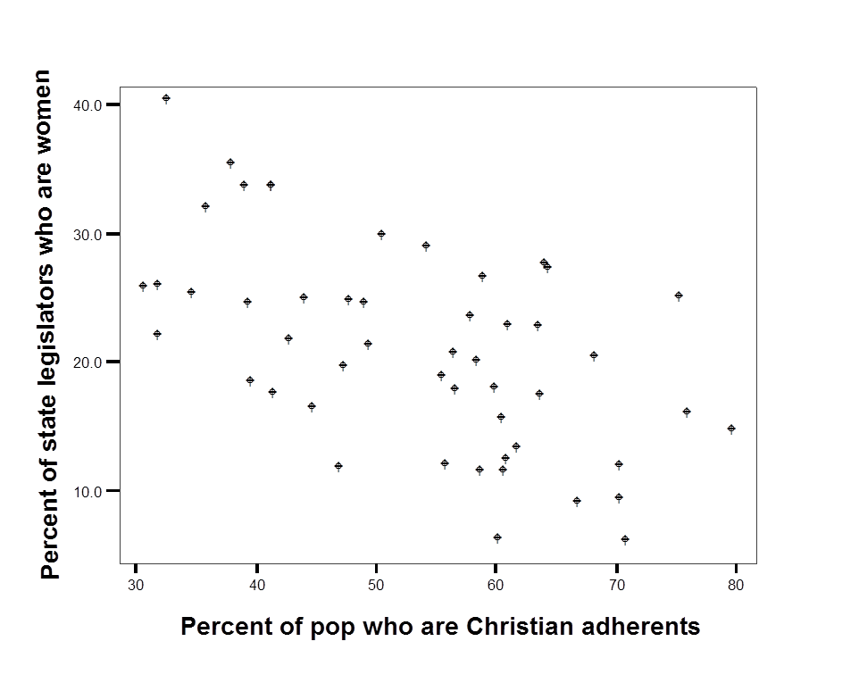
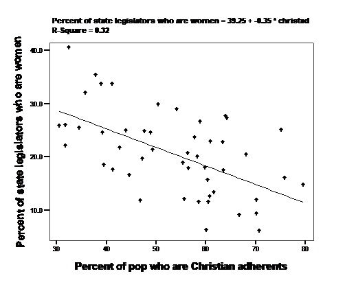
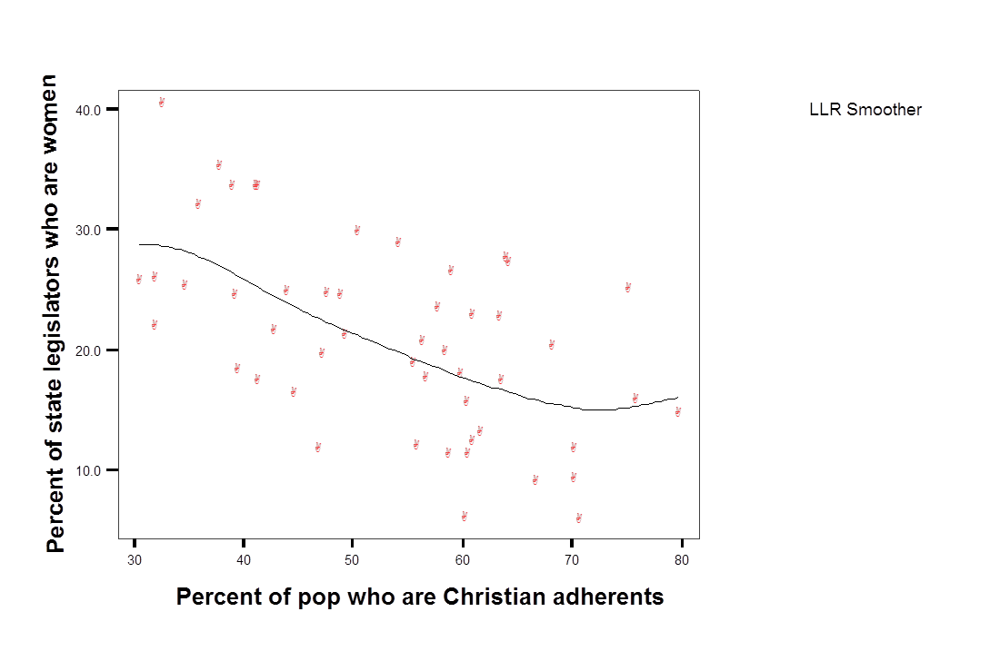

# Regression

This chapter introduces a statistical modeling approach called regression or ordinary least squares regression, sometimes abbreviated as OLS.  The idea is that we identify something we are interested in learning about or understanding, maybe why some people turn out to vote, or why they select a particular candidate, or whether or not they buy a product, or if they are diagnosed with lung cancer.  We then select a number of things that we think we could use to predict these outcomes – a theory drives these choices.  For turnout, is the person a partisan, are they educated?  For a diagnosis of lung cancer, are they a smoker, are they older or younger?  We then use data to test the link between the factors we think matter – the predictors – and the outcome of interest.  OLS is the technique that we use to determine which factors do or do not matter.

Regression is widely used in a variety of contexts – from program evaluation to marketing to campaigns.  If you work in an organization that routinely collects and analyzes data, someone in the organization will be using statistical models to make sense of that data and OLS may be one of the tools they use.

## Why not just use simple measures of association?

The measures of association introduced in earlier chapters permitted us to evaluate the link between some dependent variable (Y) and some independent variable (X) with the specific objective of determining:

- What is the direction of the effect of X on Y?
- Is this effect large or small?
- Is the sample effect statistically significant? (Can we infer something about the population from the data in our sample?)

There are two important limitations to these measures of association. 

First, we have a limited ability to convey or understand the magnitude of the relationship.  If we observe a correlation of 0.4 between income and education, what does that mean?  Yes, this would indicate that highly educated respondents are more likely to be high income, but how much income does a year of education add?  What is the difference in predicted income between a high school graduate and a college graduate?  This ambiguity also means that is challenging to directly compare the size of two effects evaluated with two different measures of association.  How does the influence of race on party id (measured with a t-test) compare to the influence of income on party id (measured with a correlation)?

A second limitation is that we can only examine the effect of a single variable at one time – what if we expect that two or more variables are jointly responsible for the observed level of Y?  

An alternative to measures of association - the simple linear model – or regression – or Ordinary Least Squares regression – or OLS – permits us to manage both of these problems. In this chapter, we focus on a simple two variable model – which helps with problem of communicating specific information about the size of the effect.  In Chapter 7, we extend the model to include more than one X variable, to manage the second limitation above. 

## Ordinary Least Squares regression (OLS)

Linear regression assumes a particular “functional form” for the relationship between X and Y, specifically that the relationship between X and Y can be summarized with a line (rather than a curve, or some other shape).  A linear model takes this form:

$$Y=\beta_0+\beta_1X+\epsilon$$

- Y and X are known (data)

- $\beta_0$ and $\beta_1$ are estimated.

- $e$ is a random error

We are principally interested in $\beta_1$ and we wish to know two things:

- What can we infer about the population from our observed $\beta_1$?  

- What does the observed $\beta_1$ tell us about the relationship between Xand Y in the sample?

The relationship between X and Y is assumed to be linear.  This assumption imposes some structure on the link between X and Y which permits us to summarize the link between X and Y with a few parameters.   If you recall high school geometry, you might remember that formula for a line is:

$$y=mx+b$$
A line is fully and completely described by two parameters, $m$ and $b$.  

- $b$ is the intercept (the point where the line crosses the vertical axis, $x=0$)

- $m$ is the slope (rise/run) or $\Delta{Y} / \Delta{X}$ 

The linear model takes the same form:

$$Y=\beta_0+\beta_1X$$

- $\beta_0$ is the intercept

- $\beta_1$ is the slope (change in Y for every one unit change in X). So, 

$$\beta_1=\frac{\Delta{Y}}{\Delta{X}}$$

And, rearranging terms,  

$$\Delta{Y} = \Delta{X}*\beta_1$$

This calculation - the size of the change in Y given a particular change in X - will be the key way that we interpret and compare the size of effects using OLS.

### Graphing relationships between two variables {-}

The relationship between two variables may be linear, or it could take some other form – U-shaped or a curve.  One way to understand the utility and use of the linear model is to produce a scatterplot of X and Y to see what it means to assume the relationship is linear.  The examples below draws on data published by @pollock2011 in an introductory text on social science statistics.  The dependent variable (Y) is the percentage of state legislators who are women and the independent or predictor variable (X) is the percentage of state population who are Christian – “adhere to a Christian faith.” 

A simple scatter plot of this data for the 50 U.S. states is reproduced as Figure 1, below.

**Figure \@ref(fig:figure61)**
Scatterplot of women in the state legislature as a function of the proportion of state residents who are Christian
```{r figure61, echo=FALSE, fig.cap="\\label{fig:figure61}", out.width = '90%', fig.align = 'center'}

```
 
Experiment with sketching the line in the figure above that you think best describes the link between the two variables.  The line is obviously downward sloping: there are a higher proportion of women in the legislature in states that have a lower proportion of Christian adherents.  But the line could be fairly steep  - passing through 40 in the upper left and approach zero for X=80.  Or the line could be fairly flat – passing through 30 in the upper left and approach 10 for X=80
 
What is best way to draw a line that describes the relationship between X and Y?

We are interested in the two parameters or numbers that describe the line that summarizes the relationship between X and Y – the slope and the intercept. What criteria should we use to pick one line over another?  Maybe the distance between points and the line (lowest average error)? Maybe the squared distance between the points and the line (lowest sum of squared errors)?  The second criteria – minimize squared error – is the approach we use. The actual regression line is added to the data in \@fig:figure62, below.

**Figure \@ref(fig:figure62)**
Scatterplot of women in the state legislature as a function of the proportion of state residents who are Christian. with OLS line
```{r figure62, echo=FALSE, fig.cap="\\label{fig:figure62}", out.width = '90%', fig.align = 'center'}

```
 
The line that best fits the data – that minimizes the sum of the squared distance between each point and the line – has a slope of -0.35   We can say some very specific things about the 50 states in the sample with this number.  Since Y is the percentage of state legislators who are women and X is the percentage of state population who are Christian, we know from the formula above the $\Delta{Y} = \Delta{X}*\beta_1$  So if we compared a state with 70 percent Christian adherents to a state with 50 percent Christian adherents ($\Delta{X}$=70-50 or 20), we would expect to see -0.35*20 or a 7 point drop in the predicted percentage of female legislators.


### Computation in the simple linear model {-}

Regression or OLS summarizes the data with a line that minimizes the sum of the squared error term ($\epsilon^2$).  For the bivariate model (one X predicting Y), the computation of $\beta_1$ is simple.  The sum of squared errors for any linear regression is minimized if:

$$\beta_1 =\frac{\sum((X-\mu_x)(Y-\mu_y))} {\sum(X-\mu_x)^2} $$

In words, the covariance of X and Y divided by the variance of X.

You can find the mathematical proof that gives the result in most introductory statistics texts.

One we have a value for $\beta_1$, we can then calculate the intercept:

$$\beta_0=\mu_y-(\mu_x*\beta_1)$$

In words, the mean of Y minus the product of the mean of X and $\beta_1$.

We don’t care much about the constant term since we are mainly interested in comparing the levels across groups – group differences are going to matter more than whether all groups are high or all groups are low on Y.   The formula for the intercept makes sure that average value of X is associated with the average value of Y.  If you rearrange the terms to solve for $\mu_y$ above, you can see that this approach will work.


### How restrictive is the assumption that the relationship is linear?   {-}

The scatterplot in Figure 2 reveals two things about the data.  First, there is a lot of error – this is a “noisy” relationship.  States with 60 percent Christian adherents range from 5 percent to 35 percent females in the legislator.  The second thing we learn is that, in this case, it appears reasonable to use a line to describe the data.  We can evaluate this directly by permitting X and Y to be linked in a way other than a line.  For an example, see Figure 3.  The points are summarized with what is known as local “smoother” – so the squared distance between the points and the line is minimized, but the path of the line is determined by a handful of points in a narrow range of X, rather than the entire sample.  Even with this very flexible approach, it appears the relationship is close to linear.


**Figure \@ref(fig:figure63)** Scatterplot of women in the state legislature as a function of the proportion of state residents who are Christian, with  local smoother.
```{r figure63, echo=FALSE, fig.cap="\\label{fig:figure63}", out.width = '90%', fig.align = 'center'}

```
 

## Interpreting regression coefficients

The linear model assumes Y is a linear function of X.  Data are used to test if the relationship between X and Y, the slope of the line, is positive, negative, or zero.  You should have an idea of what you expect to observe before you generate the output.  As was the case with measures of association, this expectation is formally labeled as the “alternative hypothesis.” In the simple linear model, we test our expectations by examining the sign (negative or positive) of $\beta_1$. 

A t-test is used to determine if the difference between the observed $\beta_1$ and zero is statistically significant.  The null hypothesis is that $\beta_1=0$ in the population. The alternative hypothesis $\beta_1\not=0$ (not equal to zero).

If p<0.05, then in the population $\beta_1$ is not equal to zero.  (Formally, you reject the null hypothesis).  The relationship between X and Y is statistically significant.

To see how regression works in practice, we use two examples – the link between the the Donald Trump feeling thermometer and party id and the link between income and party identification (introduced in Chapter 1).

#### Example: Feelings toward Donald Trump and  party identification {-}

```{r anes, echo=FALSE}
# Read the data
anes2020 <- read_dta("anes_timeseries_2020_stata_20210719.dta")

# Variables needed for this chapter:
# Weight
# Income in 3 categories
# Party identification
# Donald Trump feeling thermometer
# Education
# Income - not in categories
# Ideology

anes2020$weight<-anes2020$V200010b 
# This is the "full sample post-election weight"

# Party id
anes2020$partyid<-car::recode(anes2020$V201231x, "-9:-7=NA") 
anes2020$partyid <- factor(anes2020$partyid,
levels = c(1,2,3,4,5,6,7), ordered=TRUE,
labels = c("Strong Democrat", "Not very strong Democrat", "Leaning Democrat", "Independent", "Leaning Republican", "Not very strong Republican", "Strong Republican"))

# Income
anes2020$income<-car::recode(anes2020$V201617x, "-9:0=NA")
anes2020$income3<-car::recode(anes2020$V201617x, "-9:0=NA; 1:4=1; 5:19=2; 20:22=3")
anes2020$income3 <- factor(anes2020$income3,
levels = c(1,2,3),
labels = c("Under $25,000", "$25,000 to $150,000", "Over $150,000"))

# Education
anes2020$education<-car::recode(anes2020$V201510, "-9:0=NA; 95=NA")
anes2020$college  <-car::recode(anes2020$V201510, "-9:0=NA; 95=0; 1:5=0; 6:8=1")


# Feeling thermometer - Donald Trump
anes2020$ft_Trump<-car::recode(anes2020$V202144, "-9:-4=NA")

# Ideology self-placement
anes2020$ideology<-car::recode(anes2020$V201200, "-9:-7=NA") 
anes2020$ideology <- factor(anes2020$ideology,
levels = c(1,2,3,4,5,6,7), ordered=TRUE,
labels = c("Extremely liberal", "Liberal", "Slightly liberal", "Middle of the road", "Slightly conservative", "Conservative", "Extremely conservative"))


# Interest in politics
anes2020$interest<-car::recode(anes2020$V202407, "-9:-5=NA; 1=4; 2=3; 3=2; 4=1")
anes2020$interest <- factor(anes2020$interest,
levels = c(1,2,3,4), ordered=TRUE,
labels = c("Not at all", "Not very closely" ,"Fairly closely", "Very closely"))

anes2020$race<-car::recode(anes2020$V201549x , "-9:-8=NA; 1=0; 2:6=1")

anes2020$race2<-car::recode(anes2020$V201549x , "-9:-8=NA; 1=1; 2=2; 3=3; 4:6=4")

anes2020$female<-car::recode(anes2020$V201600, "1=0; 2=1; -9=NA") # 2 is Female, recoded to 1 is female

# Create function for weighted cross-tab <-see below
# Subset to exclude missing values

```

How are attitudes about Donald Trump related to party id? Following the approach used in earlier chapters, the link between the Donald Trump feeling thermometer and and party identification is summarized in a line chart of group means. You can see that, on average, Strong Republicans love Donald Trump while Strong Democrats do not.

**Figure \@ref(fig:figure64)**
Donald Trump feeling thermometer, as a function of party identification
```{r figure64, echo=FALSE, fig.cap="\\label{fig:figure64}", out.width = '90%', fig.align = 'center'}
figure64<- anes2020 %>% filter(anes2020$partyid!="NA") %>% group_by(partyid) %>% summarise(mean=mean(ft_Trump, na.rm=TRUE))

ggplot (figure64, aes(x=partyid, y=mean, group=1))+ylab("Feeling thermometer") + geom_line() +xlab("Party identification") + theme(axis.text.x=element_text(size=rel(0.70)))
```
 
So what exactly would a regression tell us?  To get a sense of what we might expect, consider two questions.  What exactly would you expect the feeling thermometer response to be for a Strong Democrat?  What would you expect the feeling thermometer response to be for a Strong Republican?  If you answered 85 for Strong Democrats and 25 for Strong Republicans, then you are expecting the slope of the regression line to be 10.  Why is this the case?  Recall the formula for the slope: 

$$\beta_1=\Delta{Y}/\Delta{X}$$

So, if you expect the difference between strong Democrats and strong Republicans to be about 60 ($\Delta{Y}$) and we know that the scale for party id ranges from 1 to 7, so $\Delta{X}$ is 7-1 or 6.  We know that our expected slope is:

$$60/6 = 10$$

Review and make sure you understand the calculation in this example.  

Part of the regression output for this model is reproduced as Table 1.  We will first focus on the *coefficients* - the column of numbers next to the variable labels.

**Table \@ref(tab:model1)**Donald Trump Trump feeling thermometer as a function of party id.<span style="color: white;">(\#tab:model1)</span> 

```{r model1, echo=FALSE, warning=FALSE, message=FALSE, comment=""}
model1<-lm(ft_Trump~as.numeric(partyid), data=anes2020)
library(stargazer)
stargazer (model1, style="qje", type="text" , dep.var.labels = c("Feeling Thermometer, Donald Trump"),    covariate.labels = c("Party identification", "Constant"),  omit.table.layout = "n", digits=3, report=('vc*p'), omit.stat=c("ser","f"))
```


For every unit increase in party id from 0->1, or from 1->2, the feeling thermometer increases by 13.7 points.  

So the difference between strong Democrats (1) and strong Republicans (7) is equal to (7-1)*13.7 or 82 points!  Even larger than we expected.

Notice the logic here: take the highest possible value of X and subtract the lowest possible value of X.  Multiply that number times the slope coefficient.  The approximate size of the effect in the sample is:

$$(X_{max}-X_{min}) * \beta_1$$

Notice that the significance level associated with the coefficient is below 0.05 (p=0.000).  This relationship is statistically significant.  We can be confident that, in the population, strong Republicans have much higher average feeling thermometer responses than strong Democrats.

### Example: Party id and income {-}

In Chapter 1 we looked at the link between income and party identification, expecting that high income voters are more likely to identify with the Republican party than with the Democratic party.  If Y is party id from 1 to 7 with “7” designating strong Republicans and X is income (on a scale from “1” designating $5,000 or lower household income and “22” designating $250,000 more), then $\beta_1$ should be positive.

The output from a linear regression testing the link between party id and income is reproduced as Table 2.

**Table \@ref(tab:model2)**Party identification as a function of income.<span style="color: white;">(\#tab:model2)</span> 
```{r model2, echo=FALSE, warning=FALSE, message=FALSE, comment=""}
model2<-lm(as.numeric(partyid)~income, data=anes2020)
stargazer (model2, style="qje", type="text" , dep.var.labels = c("Party identification"),    covariate.labels = c("Income", "Constant"),  omit.table.layout = "n", digits=3, report=('vc*p'), omit.stat=c("ser","f"))
```

 
What do we learn?  For every unit of income gained on the 22 point scale, your party id increases by 0.007.   So households with an income more than $250,000 (22) will really be no higher on the party id scale than households with an income of under $9,999 (1), specifically ((22-1)*0.007)=0.15 points higher on the 1-7 scale – not very much - and we can also see that p-value is 0.086 so this result is not statistically significant.  Consistent with what we saw in Chapter 3, there is no linear relationship between income and party id in 2020.

Interpretation of the meaning of the coefficient ($\beta_1$) is the key to explaining the results of a regression.  

## Hypothesis testing using OLS

In addition to using the output from the linear regression to learn about the direction and size the relationship between X and Y in the sample, we also use the output to assess statistical significance and to evaluate how well the model fits the data.  

### A technical note on the t-test {-}

The t-test is simply a one-sample t-test of whether or not $\beta_1$=0.

$$t=\frac{\beta_1-0}{\sigma_{\beta_1}} $$

The top term is simply the difference between the observed coefficient and zero.  The bottom term is the standard deviation for the coefficient.  What is this number?

### The sampling error or standard deviation of $\beta_1$   {-}

The slope coefficient has a sampling distribution just like other measures of association.  If you took a number of samples, the average of the slopes would be the population slope and the standard deviation of the slope coefficient would be:

$$\sigma_{\beta_1} =\frac{\sum\epsilon^2} {\sum(X_i-\mu_x)^2 *(n-2)}$$

In words, the sum of squared errors divided by the variance of X times n-2

This means we would expect to be very uncertain about estimates – to see a high; variance or standard deviation for $\beta_1$ - a lot of uncertainty under three conditions

- when n is not large (n-2 is small) 
- when the range of X is narrow (variance of X is small) or,
- when the there is a lot of error or noise (sum of squared errors is large). 

Note the research design implications – if the goal is precision - to minimize the sampling variance of $\beta_1$, then we would like: large n, sample values across the range of X, and a well-specified model (low errors).

## Evaluating goodness-of-fit

In addition to the coefficients and significance test, most regression output includes a useful and commonly used measure of the "goodness-of-fit" for each model estimated: the R<sup>2</sup> (or R-squared).  The calculation is below: 

$$R^2=1-\frac{\sum(Y-\widehat{Y})^2}{\sum(Y-\mu_y)^2}$$

The top half of the second term in the equation is designated the “residual sum of squares”:  the sum of the differences of any individual Y from the predicted Y (Y&#770;).  This is some times labeled "error sum of squares".

The bottom of the second term of the equation is the total sum of squares, which is the same as the variance of Y.

The value of R<sup>2</sup> is bounded between zero and one.  You can never do worse than guessing that everyone in a sample will take the mean value of a variable.  If  then the second term of the equation above become 1 and the R<sup>2</sup> =0.

If, on the other hand, you your model perfectly predicted the outcome (Y&#770; equals Y for each observation), then the second term becomes zero and the R<sup>2</sup> would be one.  R<sup>2</sup> is therefore bounded between zero and one. A low R<sup>2</sup> – closer to zero - indicates the model does not fit the data very well.   In the example above, the R<sup>2</sup> is 0.0004, so this is a model that does not fit the data at all.

### Using R<sup>2</sup> in practice {-}

R<sup>2</sup> is not useful to compare different types of models (different levels of aggregation or very different dependent variables).  R<sup>2</sup>  can be useful for comparing the overall performance of similar models.  

The best way to understand R<sup>2</sup> is that you use R<sup>2</sup> to report the proportion of the sum of squares explained by the model.  For example, if R<sup>2</sup> equals 0.2, then 20 percent of the variance in Y is explained by the model. In the example above, none (0.00%) of the variance in party identification is explained by income. But in the first example, party identification alone predicted nearly 60% of the variation in the Donald Trump feeling thermometer.

Caveats for the use of correlation apply to R<sup>2</sup> as well (relative magnitude is most useful comparison).

## Dummy variables

Some research situations require using categorical or nominal variables (marital status, race, gender, religion, region) in the simple linear model.  We use dummy or indicator variables to include this type of data in linear models.

For instance, region is coded from 1-4 in the NES.  Is there any reason to expect that North Central region (coded 2) is half (by any measure) of the West (coded 4)?  No.  An alternative is to create a variable that identifies respondents from a group of interest as “1” with the rest as “0”. 

### Examples of dummy variables {-}

#### Gender {-}

I we were interested in the difference between people who identify as Male and people who identify as Female, we could create a dummy variable that has two categories

$$ X_1=
    \begin{cases}
      0, & \text{if}\ Male \\
      1, & \text{if} \ Female
    \end{cases}$$
  
Recall that $Y=\beta_0+\beta_1X_1$.  So the constant has a specific meaning when you have a single dummy variable.

When X is a dummy variable,  the predicted value of Y is equal to the constant if X=0
 

$$Y=\beta_0$$ 

For X=1, the predicted value of Y is equal to the constant plus the slope coefficient:

$$Y=\beta_0+\beta_1$$

So while the focus remains on what the slope coefficient tells us about the difference between the two groups.  But dummy variables also give us a simple way to deterine the level of Y for each group.

The example below uses a dummy variable of the type describe above to predict the level of the Donald Trump feeling thermometer.

**Table \@ref(tab:model3)** Donald Trump feeling thermometer and gender<span style="color: white;">(\#tab:model3)</span>
```{r model3, echo=FALSE, warning=FALSE, message=FALSE, comment=""}

model3<-lm(ft_Trump~as.numeric(female), data=anes2020)

stargazer (model3, style="qje", type="text" , dep.var.labels = c("Feeling Thermometer, Donald Trump"),    covariate.labels = c("Female (dummy variable)", "Constant"),  omit.table.layout = "n", digits=3, report=('vc*p'), omit.stat=c("ser","f"))

```

The numbers in the table tell us:

For women, Y = 41.2 + -5.4*1 = 35.8

For men,   Y = 41.2 + -5.4*0 = 41.2

While the effect or link is statistically significant, so men are slightly warmer towards Trump, the effect is small (5 points).

#### Race {-}

Using a dummy variable for race, we could directly compare the effect of race with the effect of gender.  The ANES includes several categories that record the race of the respondents.  In the 2020 ANES the categories are , 1. White, non-Hispanic, 2. Black, non-Hispanic, 3.Hispanic, 4. Asian, Native Hawaiian/other Pacific Islander, Native American/Alaska Native or multiple races, non-Hispanic

If the comparison of interest is White compared to Minority, we could create a dummy variable that takes two values:  0 (race=1) and 1 (anything but race=1)

The coefficients for a simple two variable model of Donald Trump feelings and race, using the dummy variable created above, appears below as Table 5.

Table 4.  **Donald Trump feeling thermometer and race {-}**

```{r model4, echo=FALSE, warning=FALSE, message=FALSE, comment=""}

model3<-lm(ft_Trump~as.numeric(race), data=anes2020)

stargazer (model3, style="qje", type="text" , dep.var.labels = c("Feeling Thermometer, Donald Trump"),    covariate.labels = c("Minority (dummy variable)", "Constant"),  omit.table.layout = "n", digits=3, report=('vc*p'), omit.stat=c("ser","f"))

```

The regression output tells us that, for White respondents, Y = 42.5 + 16.3*0 = 42.5.  For Minorities, Y =  42.5-16.3 = 26.2.  So there is large difference between White and minority voters (16 points), but even White voters are –as a group- only are only lukewarm towards Donald Trump.

You can also see from the table that the impact of race is much bigger - the group differences (slope) is larger for race and the R<sup>2</sup> is larger.

### What if X has more than two categories? {-}

If you are interested in using a variable with many categories, then you need to use many dummy variables.  If you have N categories, then you need N-1 dummy variables. In the examples above, we had two categories, so we need one dummy variable.  If we wanted to test differences across all racial categories in the ANES (4 categories – white, black, Hispanic, other), then we would need 3 dummy variables.  One category is the baseline category and the dummy variables represent the other category. We could select White as the baseline category and use dummy variables for Black, Hispanic, and Other.  The link between the Donald Trump feeling thermometer and the race dummy variables is reproduced below.

Table 5.  **Donald Trump feeling thermometer and race (with four categories)** {-}

```{r model5, echo=FALSE, warning=FALSE, message=FALSE, comment=""}
anes2020$racef<-factor(anes2020$race2, levels=c(1,2,3,4), order=FALSE, labels=c("White", "Black", "Hispanic", "Other"))
model3<-lm(ft_Trump~racef, data=anes2020)

stargazer (model3, style="qje", type="text" , dep.var.labels = c("Feeling Thermometer, Donald Trump"),  covariate.labels = c("Black", "Hispanic",  "Other"),  omit.table.layout = "n", digits=3, report=('vc*p'), omit.stat=c("ser","f"))

```

As above, White respondents have a predicted value of 42.5.  The predicted value for Black respondents is 28 points lower! Hispanic respondents are predicted to average 12 points lower.  Other respondents are predicted to average about 8 points lower.  So, overall, feeling thermometer responses were lower for Trump among each minority group.  The R<sup>2</sup> for this model is a little higher than using a single dummy variable for race, so this model is a better fit for the ANES data.

## Summary

The linear model expresses the relationship between two variables.  The dependent variable is predictable (more or less) based on the independent variable. Regression coefficients are measures of association between the variables, expressing magnitude and direction.  Each coefficient in a linear regression is tested for statistical significance with a t-test. Is the coefficient different from zero in the population?  A goodness-of-fit test statistic - R<sup>2</sup> summarizes the extent to which the independent variable(s) explain the level of the dependent variable.  Dummy variables enable us to compare groups that can’t be ordered in any inherently meaningful way (the same circumstances that led us to use a t-test in Assignment #2).

